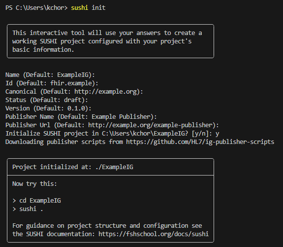
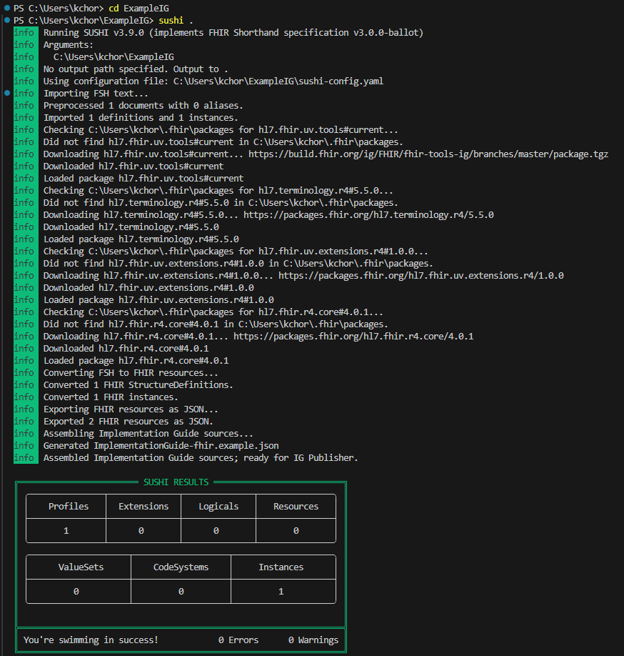
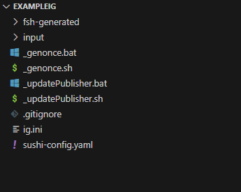

# Generación de una Guía de Implementación desde SUSHI
SUSHI es un compilador de FHIR Shorthand (FSH) que permite generar los artefactos de una Guía de Implementación desde el lenguaje de FSH. Este puede ser usado en conjunto con Publisher para generar la versión web de una guía de implementación.

# Instalación de SUSHI
Se requiere de Node.js y este se puede descargar desde https://nodejs.org/. Una vez instalado se utilizan los siguientes comandos para verificar que la instalación fue correcta:
```
node --version
npm --version
 ```
Una vez instalado Node.js se procede con la instalación de SUSHI. Para esto se corren los siguientes comandos:
```
npm install -g fsh-sushi
```
Se verifica la instalación con el comando:
```
sushi --help
```
# Usando SUSHI

### Generar un nuevo proyecto con SUSHI
Para generar un proyecto con SUSHI se puede utilizar el comando ```init```, el cual puede tomar como entradas (input) archivos FSH o crearse desde cero. Una vez ejecutado el comando se solicitará información sobre el proyecto
```
sushi init
```


Para ejecutar SUSHI se utliza el siguiente comando:
```
sushi {directorio} {opciones}
```
En opciones se pueden utilizar los siguientes comandos:
```
-o, --out <out>   directorio de salida (default: /build)
-h, --help        información de las salidas
-v, --version     indicar la versión de sushi
-s, --snapshot    generar profile snapshots
```
En caso de utilizar el comando desde el mismo directorio de los archivos .fsh el comando puede ser acortado a:
```
sushi .
```


Ejecutar SUSHI genera una carpeta denominada **/fsh_generated** donde se encuentran los recursos necesarios para la guía de implementación. Existen otros archivos que pueden ser generados por SUSHI si son especificados por el autor en las opciones.


# Publicación de la GI
Una vez creada la Guía de Implementación se procede con su publicación en el sitio de FHIR Continuous Integration (CI) build service. Este método de publicación se basa en la asociación con un repositorio de GitHub, donde cada commit resulta en una publicación en https://build.fhir.org/ig/.

### Guía de publicación
1. Crear una GI en una carpeta nueva incluyendo un archivo llamado **ig.ini** en la misma. Además, se incluyen otros elementos que la GI pueda requerir.
2. Poner tu GI en GitHub creando un repositorio público y haciendo push del contenido a GitHub
3. Añadir el FHIR GI Builder instalando https://github.com/apps/fhir-ig-builder en el repositorio

Con estas consideraciones GitHub automáticamente generará una build al hacer commits en el repositorio. Después de que la build se haya completado es posible:
#### Encuentra automáticamente tu IG renderizado disponible en:
https://build.fhir.org/ig/:org/:repo/branches/:branch

(La branch predeterminada también estará disponible directamente en https://build.fhir.org/ig/:org/:repo)

### Encuentra información de depuración sobre la build
Para un log de la build, ve a: https://build.fhir.org/ig/:org/:repo/branches/:branch/build.log

(Los logs para la branch predeterminada también estarán disponibles directamente en https://build.fhir.org/ig/:org/:repo/build.log)

En caso de que la build falle, el log estará disponible en https://build.fhir.org/ig/:org/:repo/branches/:branch/failure/build.log

#### Si deseas activar manualmente una build
Siempre puedes hacer push a un nuevo commit en tu repositorio. Pero si deseas volver a generar una build para un commit existente, tienes algunas opciones.

Puedes utilizar el dashboard en https://fhir.github.io/auto-ig-builder.

O si estás utilizando web hooks, puedes navegar a través de la interfaz de GitHub dentro de tu repositorio en "Settings > Webhooks > ig-commit-trigger", desplázate hacia abajo hasta "Recent Deliveries", haz clic en la primera y luego en "Redeliver".

O si deseas activar una build programando, puedes hacer POST a la Webhook URL tú mismo, especificando un branch, organización y repositorio. Por ejemplo, con la organización ```test-igs```, el repositorio ```simple``` y la branch ```master```:
```
curl -X POST  "https://us-central1-fhir-org-starter-project.cloudfunctions.net/ig-commit-trigger" \
  -H "Content-type: application/json" \
  --data '{"ref": "refs/heads/master", "repository": {"full_name": "test-igs/simple"}}'
```
#### Resumenes/estadísticas de las CI Builds actuales
Los resumenes/estadísticas de las CI Builds actuales están disponibles en: https://fhir.github.io/auto-ig-builder

