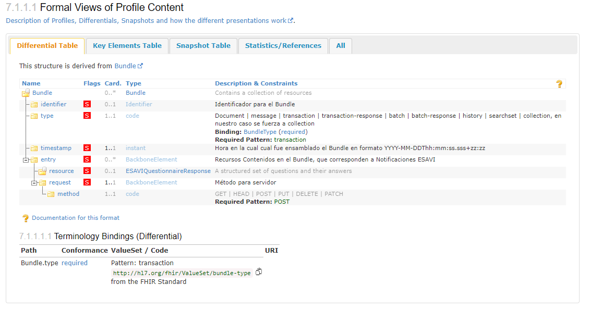

# Volcamiento de Grandes Volumenes de Datos
A continuación se describe el proceso que se realiza para cargar grandes cantidades de información al servidor. Para esto se tiene como recurso principal un **Bundle**, el cual permite el transporte de notificaciones en forma de bloque. Dentro de la Guía de Implementación de ESAVI está denominado como [Bundle Transacción de grupos de notificaciones](https://build.fhir.org/ig/PanAmericanHealthOrganization/ESAVI-IG-FHIR/StructureDefinition-BundleESAVI.html)

### Descripción del Recurso


### Procedimiento
Para envíar un Bundle se hace un POST a la URL del servidor con el bloque de información. 

```
POST: {baseURL}/{Recurso}
```

Cabe destacar que no es necesario especificar el tipo de recurso como Bundle al hacer la operación POST, pues cada elemento del mismo actúa como una solicitud con un tipo de operación HTTP específica, la cual es informada al sistema al momento de hacer la transacción.